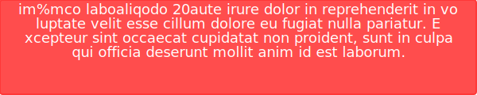

# GithubAlert

## Features
1. Creates fancy SVG images with text messages
2. Choose between different message types
3. Choose font & font-size for the message
4. Choose message text color & background color
5. Get SVG images dynamically from an API
6. Edit messages on the fly with the API
7. Deploy your own <b>GithubAlert</b> API
